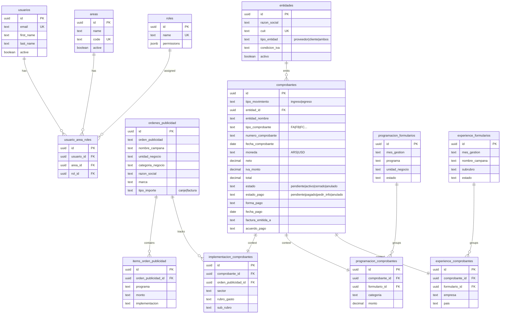

# Luzu ERP - Entity Relationship Diagram



## View Options

1. **DBML Format** (recommended): Open `erd.dbml` at [dbdiagram.io](https://dbdiagram.io/d)
2. **Mermaid**: View this file in VS Code with Mermaid extension or on GitHub

## Architecture Summary

```
┌─────────────────────────────────────────────────────────────────┐
│                         COMPROBANTES                            │
│                    (Central financial table)                    │
│         tipo_movimiento: ingreso | egreso                       │
│   estado_pago: pendiente | pagado | pedir_info | anulado       │
│   Consolidated: factura_emitida_a, acuerdo_pago, forma_pago   │
└─────────────────────────────────────────────────────────────────┘
                              │
          ┌───────────────────┼───────────────────┐
          │                   │                   │
          ▼                   ▼                   ▼
┌─────────────────┐ ┌─────────────────┐ ┌─────────────────┐
│ IMPLEMENTACION  │ │  PROGRAMACION   │ │   EXPERIENCE    │
│  _comprobantes  │ │  _comprobantes  │ │  _comprobantes  │
│    (context)    │ │    (context)    │ │    (context)    │
└────────┬────────┘ └────────┬────────┘ └────────┬────────┘
         │                   │                   │
         ▼                   ▼                   ▼
┌─────────────────┐ ┌─────────────────┐ ┌─────────────────┐
│    ordenes_     │ │  programacion_  │ │  experience_    │
│   publicidad    │ │   formularios   │ │   formularios   │
└─────────────────┘ └─────────────────┘ └─────────────────┘
```

## Key Relationships

| Module | Header | Context | Links To |
|--------|--------|---------|----------|
| Implementación | ordenes_publicidad | implementacion_comprobantes | comprobantes |
| Programación | programacion_formularios | programacion_comprobantes | comprobantes |
| Experience | experience_formularios | experience_comprobantes | comprobantes |
| Finanzas/Admin | - | - | comprobantes_full (view) |
